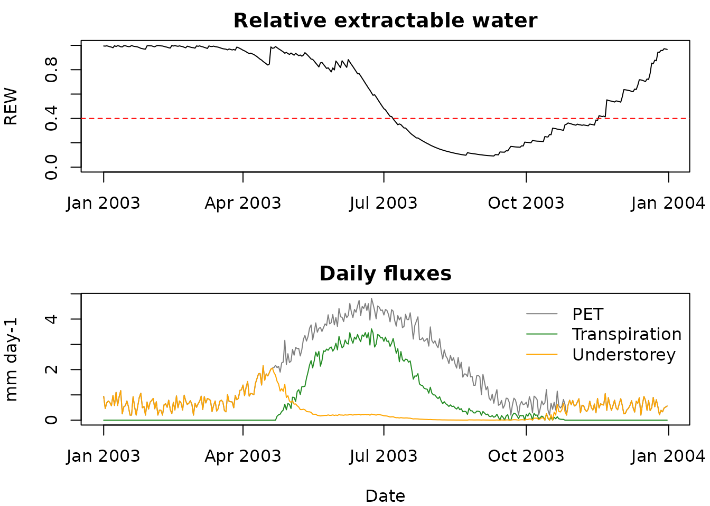

# The BILJOU forest water balance model in R

`biljouR` is an independent R re-implementation of the **BILJOU** lumped
daily forest water balance model (Granier, Bréda, Biron & Villette,
1999, *Ecological Modelling* 116:269-283), as documented by INRAE UMR
Silva (<https://appgeodb.nancy.inrae.fr/biljou/>). It is **not**
produced or endorsed by INRAE; use the official tool for authoritative
simulations.

## The model in one equation

The model integrates, at a **daily** time step, the soil water balance

``` math
\Delta W = P - In - T - Eu - D
```

where `P` is rainfall, `In` rainfall interception, `T` overstorey
transpiration, `Eu` understorey + soil evaporation and `D` drainage.
Drainage is obtained by difference / cascade through the soil layers.

### Elementary fluxes

- **LAI phenology.** Evergreen stands keep a constant LAI; deciduous
  stands ramp from 0 to `lai_max` over 30 days after budburst and back
  to 0 over the 30 days before leaf fall.
- **Transpiration.** $`T = r(LAI) \cdot PET`$, with
  $`r = 0.125 \cdot LAI`$ for $`LAI \le 6`$ and $`r = 0.75`$ above.
  $`T`$ is reduced by 20 % of intercepted water (wet canopy) and scaled
  by $`REW/REW_c`$ under water stress ($`REW_c = 0.4`$).
- **Interception.**
  $`Th = \exp(a + b \cdot R/R_0 + c \cdot P + d \cdot P^2)`$,
  $`In = P - Th`$ (Aussenac 1968), with stand-type coefficients;
  $`R/R_0 = 100 \cdot \exp(-k \cdot LAI)`$.
- **Understorey/soil evaporation.**
  $`Eu = PET \cdot \exp(-k \cdot LAI)`$, limited by the upper-layer
  water.
- **Soil & drainage.** Each layer refills through its microporosity
  while a fraction bypasses quickly through macroporosity; water above
  field capacity drains to the next layer. Root uptake is weighted by
  fine-root fraction and current relative extractable water.

## A worked example

``` r

library(biljouR)
data(meteo_hesse)

soil <- biljou_soil(
  ewm   = c(70, 70, 40),                 # mm extractable water per layer
  roots = c(0.6, 0.3, 0.1),              # fine-root fractions
  macro = c(0.3, 0.2, 0.1),              # optional macroporosity
  micro = c(0.7, 0.8, 0.9)               # optional microporosity
)
soil
#> <biljou_soil>: 3 layer(s)
#>  layer ewm_mm root_frac bypass_frac
#>      1     70       0.6         0.3
#>      2     70       0.3         0.2
#>      3     40       0.1         0.1
#> Total extractable water (EWM): 180 mm

run <- biljou_run(meteo_hesse, soil, lai_max = 6,
                  forest_type = "broadleaved",
                  budburst = 110, leaf_fall = 300)
run
#> <biljou_run>: 365 days, broadleaved stand, LAI_max = 6 
#> Period: 2003-01-01 to 2003-12-31 
#> Totals (mm): rain=652  interception=45  transpiration=254  understorey=165  drainage=194
#> Min REW=0.09  stress days (REW<0.40)=133
```

### Drought indices and balance

``` r

biljou_indices(run)
#>   year NJstress  Istress DEBstress    min_rew  is_1999  rain transpiration
#> 1 2003      113 58.67041       188 0.09185474 23.46816 232.8      254.4782
#>   understorey interception drainage       et
#> 1    40.38769     45.08485 7.084437 339.9507
biljou_annual_balance(run)
#>   year  rain interception throughfall transpiration understorey       et
#> 1 2003 651.8     45.08485    606.7151      254.4782    164.6177 464.1807
#>   drainage
#> 1 193.6184
```

### Visualising the season

``` r

plot(run)
```



## Computing Penman PET

BILJOU is calibrated on **Penman** PET. If you do not already have it:

``` r

penman_pet(tmean = 18, rg = 22, wind = 2, rh = 65,
           doy = 180, latitude = 48.6, altitude = 250)
#> [1] 5.081286
```

## Graphics, inter-annual statistics and mapping

With `ggplot2` installed, the package draws the same families of figures
as the online tool. On a multi-year run:

``` r

# multi-year chronicle / faceted time series
biljou_plot_timeseries(run, vars = c("ETP", "ETR", "transpiration", "REW"))

# overlay years by day-of-year, with a median curve (REW shown with its threshold)
biljou_plot_overlay(run, var = "REW", stat = "median")
```

Inter-annual statistics by day-of-year (base R, no extra dependency):

``` r

stats <- biljou_doy_stats(run, var = "REW", probs = c(0.1, 0.9))
head(stats)   # doy, n, mean, sd, median, q10, q90
```

To reproduce BILJOU-style **maps**, run the model over a grid of points
and export to `sf`/`terra`. SAFRAN data (Meteo-France, 8 km, free) are
read with
[`safran_to_meteo()`](https://pobsteta.github.io/biljouR/reference/safran_to_meteo.md);
see the README for download links.

``` r

grid <- biljou_run_grid(points, meteo = meteo_per_point,
                        soil = biljou_soil(140), lai_max = 5,
                        forest_type = "broadleaved",
                        budburst = 110, leaf_fall = 300,
                        indicators = "NJstress")
r <- biljou_grid_to_raster(grid, indicator = "NJstress", year = 2003)
terra::plot(r)
```

## Caveats

Some constants are only described qualitatively in the public BILJOU
documentation. The choices made here (macro/micro split, root-uptake
weighting, understorey coefficient, interception clamping) are
transparent and documented in the source, but should be **validated
against the official tool** before production use.
